# DevOps-Prime Demo Environment — Full Pipeline Documentation

## Overview

A fully automated CI/CD pipeline on Google Kubernetes Engine (GKE) that demonstrates a realistic enterprise DevOps toolchain with **10 deliberately broken applications**.

```mermaid
graph LR
    A[GitHub Repo] -->|Push Code| B[Jenkins Pipeline]
    B -->|Build & Test| C[Container Images]
    C -->|Trigger Sync| D[ArgoCD GitOps]
    D -->|Deploy| E[GKE Cluster]
    E -->|Scrape Metrics| F[Prometheus]
    F -->|Visualize| G[Grafana Dashboard]
    G -->|Alert| H[Ops Team Troubleshoots]
```



## Architecture

| Component | Purpose | Endpoint |
|-----------|---------|----------|
| **GKE Cluster** | Kubernetes runtime | `demo-gke-cluster` · `us-central1-a` |
| **Jenkins** | CI/CD pipeline server | http://localhost:8081 (port-forward) |
| **ArgoCD** | GitOps deployment manager | http://localhost:8080 (port-forward) |
| **Prometheus** | Metrics collection & alerting | http://localhost:9090 (port-forward) |
| **Grafana** | Dashboards & visualization | http://localhost:3000 (port-forward) |
| **Ingress-NGINX** | External traffic routing | `34.70.113.158` |

## The 10 Demo Applications (All Deliberately Broken)

| # | App | Issue | Symptom | Debug Signal |
|---|-----|-------|---------|--------------|
| 1 | `app1-frontend` | Memory limit < request | OOMKilled / CrashLoopBackOff | `kubectl describe pod` shows OOMKilled |
| 2 | `app2-backend-api` | Non-existent image tag | ImagePullBackOff | `kubectl describe pod` shows ErrImagePull |
| 3 | `app3-worker-process` | Missing config file | CrashLoopBackOff | `kubectl logs` shows "FATAL: Config file not found" |
| 4 | `app4-redis-cache` | Non-existent PVC | Pending | `kubectl get pvc` shows missing |
| 5 | `app5-postgres-db` | Invalid StorageClass | Pending | `kubectl describe pvc` shows SC not found |
| 6 | `app6-nginx-proxy` | Wrong readiness probe port | Not Ready | Probe hits port 9999, nginx on 80 |
| 7 | `app7-metrics-collector` | Aggressive liveness probe | Frequent restarts | Probe triggers before Prometheus starts |
| 8 | `app8-log-aggregator` | Impossible memory request | Unschedulable | 1024Gi request exceeds node capacity |
| 9 | `app9-task-scheduler` | Readiness file never created | Not Ready | `test -f /tmp/scheduler-ready` always fails |
| 10 | `app10-message-queue` | Service port mismatch | AMQP unreachable | Service on 15672, clients need 5672 |

## Full Demo Flow

### Step 1: Code Push to GitHub
```bash
git push origin main
```
Jenkins detects the webhook (simulated) and starts the `demo-devops-prime-pipeline`.

### Step 2: Jenkins Pipeline Runs
Stages:
1. **Code Checkout** — Clones `devops-prime-app/puntus-env.git`
2. **Build & Test** — Builds 10 container images
3. **Security Scan** — Finds 12 HIGH, 8 MEDIUM vulnerabilities (expected)
4. **Deploy to GKE via ArgoCD** — Triggers ArgoCD sync
5. **Health Check** — Detects all 10 failures, pipeline fails (expected)

### Step 3: ArgoCD Deploys
- All 10 apps are registered as **ArgoCD Applications**
- Shows `OutOfSync`, `Progressing`, `Unknown` statuses
- Demonstrates GitOps reconciliation loop

### Step 4: Prometheus Monitors
- Scrapes metrics from all `demo-apps` pods every 30s
- Tracks: pod restarts, memory usage, pod phases, CPU usage
- Generates alerts for CrashLoopBackOff, OOMKilled, Pending pods

### Step 5: Grafana Visualizes
- **Demo Apps Health Dashboard** (UID: `devops-prime-demo`)
- Panels: Pod restarts, memory usage, pod status table
- Real-time refreshes showing the broken state

### Step 6: Troubleshoot
The ops team uses:
1. **Grafana** to see which apps are unhealthy
2. **Prometheus** alerts to identify critical issues
3. **ArgoCD** to see deployment drift
4. **Jenkins** to re-run the pipeline after fixes
5. **kubectl** to debug individual pods

## Access Guide

### Port-Forward (recommended for local access)

```bash
export KUBECONFIG=/Users/obinnaibekwe/Downloads/puntus-env/kubeconfig-demo.yaml

# ArgoCD     → http://localhost:8080
kubectl port-forward -n argocd svc/argocd-server 8080:80 &

# Jenkins    → http://localhost:8081
kubectl port-forward -n jenkins svc/jenkins 8081:8080 &

# Grafana    → http://localhost:3000
kubectl port-forward -n monitoring svc/monitoring-grafana 3000:80 &

# Prometheus → http://localhost:9090
kubectl port-forward -n monitoring svc/monitoring-kube-prometheus-prometheus 9090:9090 &
```

### Credentials

| Service | Username | Password |
|---------|----------|----------|
| ArgoCD | `admin` | `7RH2fBLbpsAVr785` |
| Jenkins | `admin` | `vBaRtAAxQsp4ht2eeQWpGR` |
| Grafana | `admin` | `DevOpsPrime2024!` |
| Prometheus | *(no auth)* | — |

### Kubernetes API (for devops-prime.com connector)
- **API Server**: `https://34.132.161.0`
- **Kubeconfig**: `/Users/obinnaibekwe/Downloads/puntus-env/kubeconfig-demo.yaml`
- **SA Token**: `devops-prime-connector` in `kube-system` (cluster-admin)

## Jenkins Pipeline Details

**Pipeline Name**: `demo-devops-prime-pipeline`

Stages:
```
Code Checkout → Build & Test → Security Scan → Deploy via ArgoCD → Health Check
```

The pipeline **intentionally fails** at the Health Check stage — showing that CI/CD catches production issues.

## Grafana Dashboard

**Dashboard Name**: `Demo Apps - DevOps-Prime Health Dashboard`
**UID**: `devops-prime-demo`

Panels:
- **Pod Restarts (last 5m)** — Shows app1 (OOMKill) and app7 (liveness probe) restarting
- **Memory Usage** — Shows app8 requesting 1024Gi (impossible)
- **Pod Status Table** — Shows Running vs Pending vs CrashLoopBackOff

## Infrastructure as Code

All infrastructure is managed via Terraform:

```bash
cd /Users/obinnaibekwe/Downloads/puntus-env

# Deploy
terraform apply -auto-approve
./deploy-infra.sh   # ArgoCD, Jenkins, Prometheus/Grafana, Ingress-NGINX
./deploy-helm.sh    # 10 broken demo apps
./verify-setup.sh   # Check expected failures

# Destroy
terraform destroy -auto-approve
```

## Token Refresh (every 24h)

```bash
gcloud container clusters get-credentials demo-gke-cluster --zone=us-central1-a --project=project-13f5069c-9cac-4db9-8d9
kubectl create token devops-prime-connector -n kube-system --duration=86400s
```

## CI/CD via GitHub Actions

GitHub Actions workflows in `.github/workflows/`:
- `deploy.yml` — Full deploy pipeline (Terraform + Helm)
- `destroy.yml` — Infrastructure teardown

Required secrets: `GCP_PROJECT_ID`, `GCP_WIF_PROVIDER`, `GCP_WIF_SA`
